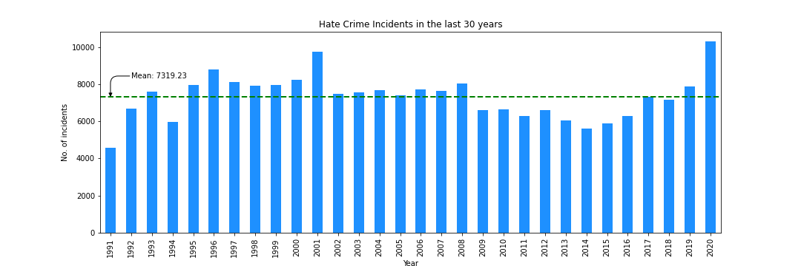
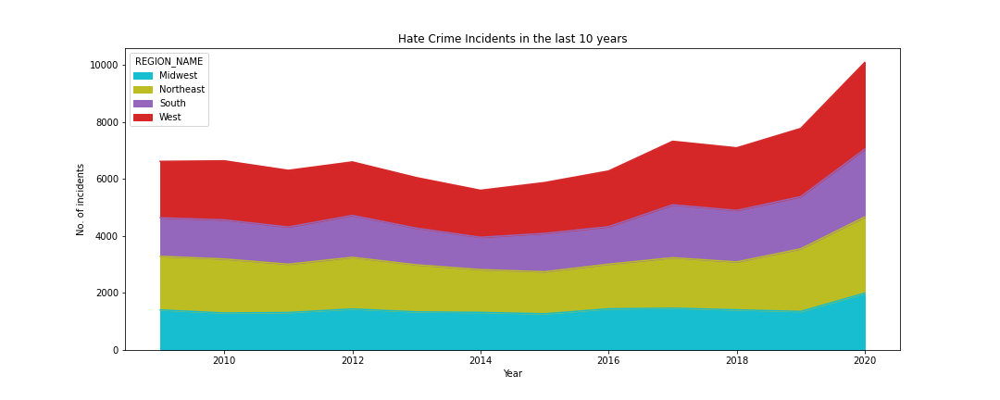
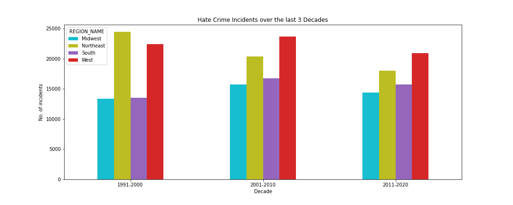
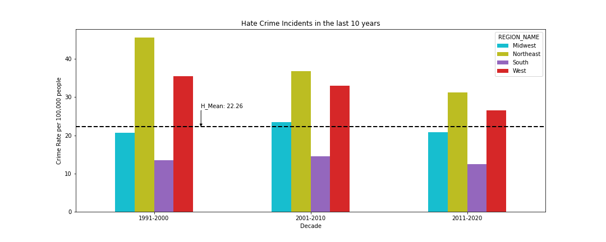

# Exploratory_Analysis_Project

1. Three decade analysis - Sakshi

Hate Crime incidents per year (1991-2020)

Hate Crimes by Region of the U.S.(2011-2020)

 
2. Group by region to see if some regions are different from others - Sakshi

Hate Crimes by Region over 3 decades

Hate Crimes by Region over 3 decades

3. How many are multiple offenses vs single? - Abbie

4. Possibly get mean, std, and max for victim_count - Abbie

